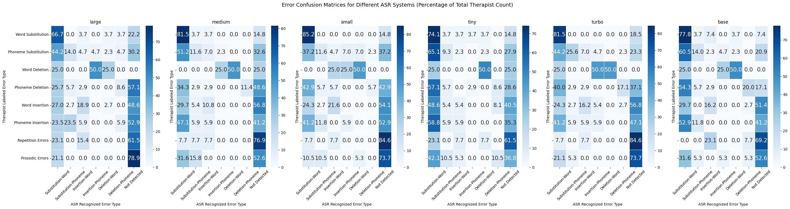

# Towards Temporally Explainable Speech Clarity Assessment for Dysarthric Speech
### Submitted to Interspeech 2025

## Table of Contents  
1. [Examples from our dataset](#1-examples-from-our-dataset)  
2. [Mispronunciation Classification](#2-section-45-mispronunciation-classification)
   - 2.1 [ASR-wise Class Confusion Matrices](#21-asr-wise-class-confusion-matrices)  
   - 2.2 [Exact Error Matches](#22-exact-error-matches)
3. [Examples for Word/Phoneme Substitution, Deletion, Insertion from ASR](#3-section-3-examples-for-word-phoneme-substitution-deletion-insertion-from-asr)
4. [Prompting Strategy to Convert Therapist's Descriptive Error Labels to Mispronunciation Classes](#4-section-21-prompting-strategy-to-convert-therapists-descriptive-error-labels-to-mispronunciation-classes)

## 1. Examples from our dataset
Each example consists of the therapist's annotation file screenshot for a particular mispronunciation label in an audio file, and the corresponding audio snippet. The error localized and classified by an ASR is also shown.
<table style="width:100%; text-align:center;">
<tr>
<td style="width:50%;"></td>
<td style="width:50%;"></td>
</tr>
<tr>
<td>
<audio controls>
<source src="example3.mp3" type="audio/mpeg">
Your browser does not support the audio element.
</audio>
</td>
<td>
<audio controls>
<source src="example2.mp3" type="audio/mpeg">
Your browser does not support the audio element.
</audio>
</td>
</tr>
</table>

---

## 2. (Section 4.5) Mispronunciation Classification

### 2.1 ASR-wise Class Confusion Matrices
Word-level


Phone-level


### 2.2 Exact Error Matches
<table style="width:100%; text-align:center;">
<tr>
<td style="width:50%;"></td>
<td style="width:50%;"></td>
</tr>
</table>

---
## 3. (Section 3) Examples for Word/Phoneme Substitution, Deletion, Insertion from ASR

### Rules
- **Substitution-Word** → If edit distance > 3 **OR** relative distance > 0.6
- **Substitution-Phoneme** → If edit distance ≤ 3 **AND** relative distance ≤ 0.6
- **Insertion/Deletion-Phoneme** → If phoneme-level edit fits insertion/deletion patterns

### Examples

#### 1. Substitution-Word (Absolute Distance > 3)
- **ASR:** `'RED'` → **Original:** `'RAINDROPS'`
- **Phonemes:** `/ɹ ɛ d/` vs. `/ɹ eɪ n d ɹ ɑ p s/`
- **Edit Distance = 4** → Word-Level

#### 2. Substitution-Word (Relative Distance > 0.6)
- **ASR:** `'PRINCE'` → **Original:** `'PRISM'`
- **Edit Distance = 3, Relative = 0.75** → Word-Level

#### 3. Substitution-Phoneme
- **ASR:** `'SAY'` → **Original:** `'STAY'`
- **Phonemes:** `/s eɪ/` vs. `/s t eɪ/`
- **Edit Distance = 1, Relative = 0.33** → Phoneme-Level

#### 4. Insertion-Phoneme
- **ASR:** `'THEY'` → **Original:** `'THE'`
- **Edit Distance = 1, Relative = 0.33** → Phoneme-Level

#### 5. Deletion-Phoneme
- **ASR:** `'FRIEND'` → **Original:** `'FRIENDS'`
- **Missing final** `/z/`, **Edit Distance = 1, Relative = 0.2** → Phoneme-Level

---

## 4. (Section 2.1) Prompting Strategy to Convert Therapist's Descriptive Error Labels to Mispronunciation Classes

```plaintext
prompt = f"""
You are a world-class Speech-Language Pathologist specializing in speech disorder classification and ASR (Automatic Speech Recognition) error analysis. Your task is to categorize the given speech error label into one of the predefined categories with high accuracy.

### **Strict Categorization Guidelines**
- **Follow the categorization rules precisely. No assumptions or reinterpretations.**
- **If a label contains multiple error types, select the most specific category based on hierarchy.**
- **Do not include explanations, reasoning, or any additional text. Return only the category name.**

---

### **Categorization Rules (Hierarchy-Based)**
1. **Substitution Errors**  
   - A phoneme or word is replaced with another phoneme or word.  
   - MUST be used if "phonemic sub", "word sub", or "transposition" appears in the label.  
   - **Examples:**  
     - "look, took, phonemic sub 'l' to 'k' or word sub" → "Substitution Errors"  
     - "horizon, phonemic sub/distortion of vowel" → "Substitution Errors"  

2. **Deletion Errors**  
   - A phoneme or word is missing.  
   - MUST be used if "phonemic del" or "deletion" appears in the label.  
   - **Examples:**  
     - "raindrops, raindops, phonemic del" → "Deletion Errors"  
     - "act, ac, phonemic del (SCE), strained voice" → "Deletion Errors"  

3. **Insertion Errors**  
   - An extra phoneme or word is added.  
   - MUST be used if "addition" appears in the label.  
   - **Examples:**  
     - "word addition 'big'" → "Insertion Errors"  
     - "phonemic addition its -> biz" → "Insertion Errors"  

4. **Repetition Errors**  
   - A phoneme or word is repeated.  
   - MUST be used if "repetition" appears in the label.  
   - **Examples:**  
     - "his, his his, repetition" → "Repetition Errors"  
     - "prism, prism.prisms, repetition+ phonemic addition" → "Repetition Errors"  
     - "word repetition 'look'" → "Repetition Errors"  

5. **Prosodic Errors**  
   - Irregular pauses, unnatural intonation, or breaks between words.  
   - MUST be used if the label includes: "pause", "intonation", "break", "timing issue".  
   - **Examples:**  
     - "gold at one end, gold...at one end, irregular break between words" → "Prosodic Errors"  
     - "strained voice" → "Prosodic Errors"  

---

### **Input**
"{label}"

### **Output Format**
- **Return only one category name:**  
  `Substitution Errors`, `Deletion Errors`, `Insertion Errors`, `Repetition Errors`, or `Prosodic Errors`.  
- **Do NOT include explanations, reasoning, or additional text.**
"""
```
