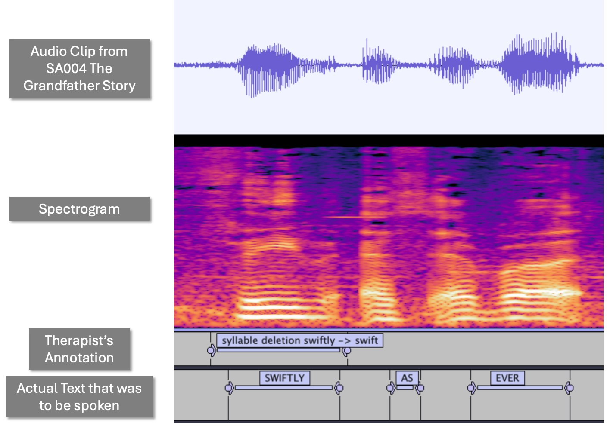

# Towards Temporally Explainable Speech Clarity Assessment for Dysarthric Speech
### Submitted to Interspeech 2025

## 1. Examples from our dataset
Each example consists of an image and an audio file:
-  [🔊 Example 1 Audio](example1.mp3)
-  [🔊 Example 2 Audio](example2.mp3)

---

## 2. (Section 4.5) Mispronunciation Classification

### 2.1 ASR-wise Class Confusion Matrices


### 2.2 Exact Error Matches


---

## 3. (Section 2.1) Prompting Strategy to Convert Therapist's Descriptive Error Labels to Mispronunciation Classes

```plaintext
prompt = f"""
You are a world-class Speech-Language Pathologist specializing in speech disorder classification and ASR (Automatic Speech Recognition) error analysis. Your task is to categorize the given speech error label into one of the predefined categories with high accuracy.

### **Strict Categorization Guidelines**
- **Follow the categorization rules precisely. No assumptions or reinterpretations.**
- **If a label contains multiple error types, select the most specific category based on hierarchy.**
- **Do not include explanations, reasoning, or any additional text. Return only the category name.**

---

### **Categorization Rules (Hierarchy-Based)**
1. **Substitution Errors**  
   - A phoneme or word is replaced with another phoneme or word.  
   - MUST be used if "phonemic sub", "word sub", or "transposition" appears in the label.  
   - **Examples:**  
     - "look, took, phonemic sub 'l' to 'k' or word sub" → "Substitution Errors"  
     - "horizon, phonemic sub/distortion of vowel" → "Substitution Errors"  

2. **Deletion Errors**  
   - A phoneme or word is missing.  
   - MUST be used if "phonemic del" or "deletion" appears in the label.  
   - **Examples:**  
     - "raindrops, raindops, phonemic del" → "Deletion Errors"  
     - "act, ac, phonemic del (SCE), strained voice" → "Deletion Errors"  

3. **Insertion Errors**  
   - An extra phoneme or word is added.  
   - MUST be used if "addition" appears in the label.  
   - **Examples:**  
     - "word addition 'big'" → "Insertion Errors"  
     - "phonemic addition its -> biz" → "Insertion Errors"  

4. **Repetition Errors**  
   - A phoneme or word is repeated.  
   - MUST be used if "repetition" appears in the label.  
   - **Examples:**  
     - "his, his his, repetition" → "Repetition Errors"  
     - "prism, prism.prisms, repetition+ phonemic addition" → "Repetition Errors"  
     - "word repetition 'look'" → "Repetition Errors"  

5. **Prosodic Errors**  
   - Irregular pauses, unnatural intonation, or breaks between words.  
   - MUST be used if the label includes: "pause", "intonation", "break", "timing issue".  
   - **Examples:**  
     - "gold at one end, gold...at one end, irregular break between words" → "Prosodic Errors"  
     - "strained voice" → "Prosodic Errors"  

---

### **Input**
"{label}"

### **Output Format**
- **Return only one category name:**  
  `Substitution Errors`, `Deletion Errors`, `Insertion Errors`, `Repetition Errors`, or `Prosodic Errors`.  
- **Do NOT include explanations, reasoning, or additional text.**
"""
